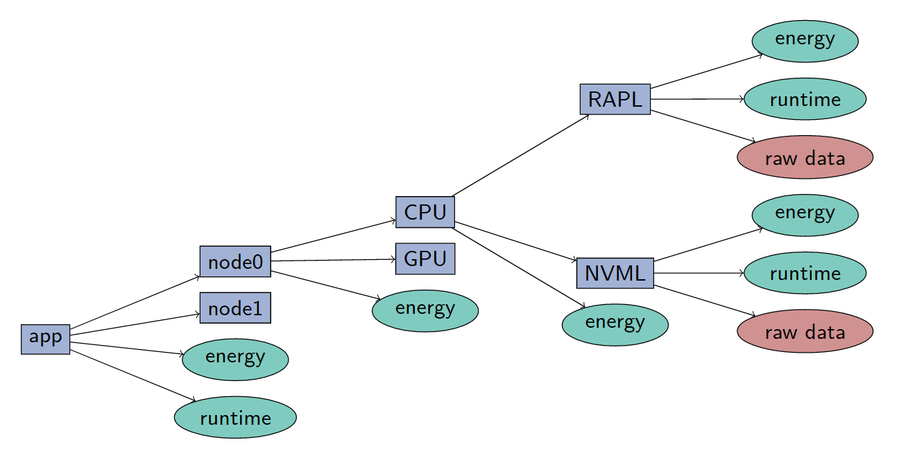

.. _data:

Data
====

perun structures the data collected as a tree, with the root node containing the aggregated data of an indiviudal run of the application, and the nodes further down the tree contain the information of the indivdual compute nodes, devices and *sensors*. *Sensors* are meant as the individual values that can be collected from the distinct monitoring backends.



Each node in the data structure, once the raw data at the bottom has been processed, contain a set of summarized metrics based on the data that was collected by its sub-nodes, and a metadata dictionary with any information that could be obtained by the application, node, device or API.

Each node contains a list of metrics or stats, which represent the accumulated data. As well as metadata.

The nodeType attribute indiciates the type of object in the hierarchy this nodes represents. At the lowest level, the leafs of the tree, you would have individual "sensors", values collected by a single device or interface. Higher up the tree, the data nodes represent groups of devices and computational nodes. The three bottom levels of the tree represent the hardware. Further up the three, data starts being acumulated by individual runs of the application, with "run" being a single execution of the application, a "multi_run" is the data from multiple runs when perun is run with the ```--rounds N``` option, and at the highest level, the root of the tree is the application itself.
